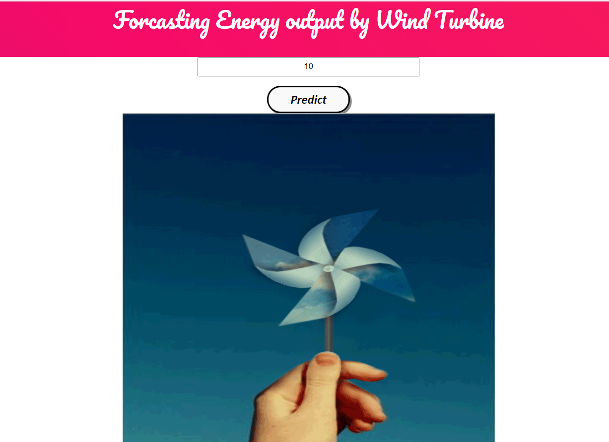
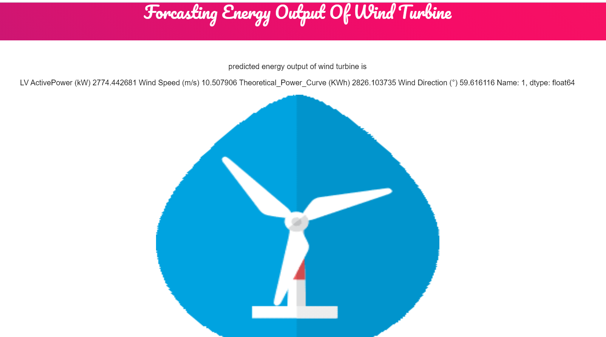

# Predicting The Energy Output Of Wind Turbine Based On Weather Condition
## Table of Content

- Demo
- Overview
- Motivation
- Technical Aspect
- Installation
- To Do
- Bug / Feature Request
- Technologies Used
---
## Demo

If you want to see the demo [click here](https://windmillapp.herokuapp.com/)






## Overview
This is Time Series Analysis based on deep learning model trained on top of the Keras API using Tensorflow as a backend.
The model takes a time (in minute) as an input and predicts the energy that would be generated after that time in future.

## Motivation


As this project is based on problem statement in competition of **IBM Smartinternz** by **SMARTBRIDGE** clearly the motivation came from this platform.
## Technical Aspect

This project is divided into two part:
1. Training a deep learning model using Keras.
2. Building and hosting a Flask web app on Heroku.

## Installation

The Code is written in Python 3.7. If you don't have Python installed you can find it here. If you are using a lower version of Python you can upgrade using the pip package, ensuring you have the latest version of pip. To install the required packages and libraries, run this command in the project directory after cloning the repository:

```commandline
pip install -r requirements.txt
```

## To Do
1.Convert the app to run without any internet connection, i.e. **PWA**.
2.Add a better vizualization chart to display the predictions.

## Bug / Feature Request
If you find a bug (the website couldn't handle the query and / or gave undesired results), kindly open an issue [here](https://github.com/SmartPracticeschool/SBSPS-Challenge-3699-Predicting-the-energy-output-of-wind-turbine-based-on-weather-condition/issues) by including your search query and the expected result.

If you'd like to request a new function, feel free to do so by opening an issue [here](https://github.com/SmartPracticeschool/SBSPS-Challenge-3699-Predicting-the-energy-output-of-wind-turbine-based-on-weather-condition/issues). Please include sample queries and their corresponding results.

## Technology Used 
made with [Python](https://www.python.org/)

- [Keras] (https://keras.io/)
- [Flask] (https://flask.palletsprojects.com/)
- [Gunicorn] (https://gunicorn.org/)
- [Tensorflow] (https://www.tensorflow.org/)

## credits

[Heroku](https://dashboard.heroku.com/) - this project wouldn't have been experienced by user without this tool.